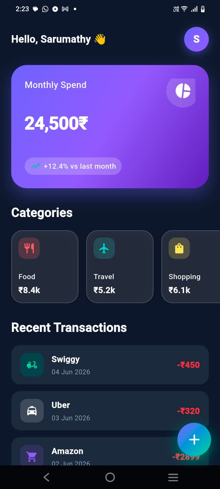
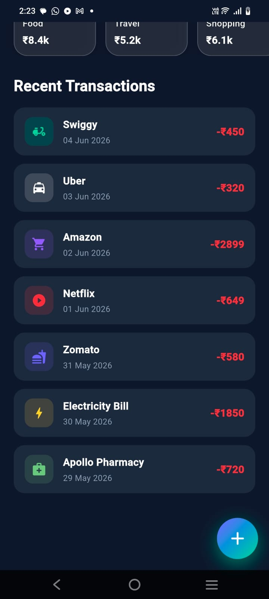

# Finance App

A recruiter take-home **Flutter** project that implements a production-style **Spend Summary Screen** for a modern fintech experience. The app uses **mock data only** (no backend, APIs, or Firebase) and is built with **Material 3**, null safety, reusable widgets, and responsive layout.

---

## Assignment Compliance

This project fulfills the take-home requirements:

| Requirement | Implementation |
|-------------|----------------|
| Spend Summary Screen | `lib/screens/spend_summary_screen.dart` |
| Header card — monthly spend | Gradient card with **₹24,500** |
| Percentage change vs last month | **+12.4%** trend indicator |
| Horizontal category scroll | 6 categories with icons and amounts |
| Recent transactions list | 7 transactions with card-style tiles |
| Floating Action Button | Bottom-right gradient FAB with Hero animation |
| Mock data only | `lib/data/mock_data.dart` |
| Reusable widgets | `common_widgets/`, `widgets/`, shared `utils/` |
| No backend / no extra packages | `flutter` + `cupertino_icons` only |

---

## Screenshots

### Spend Summary Screen



### Transactions Section



---

## Features

- **Dark fintech UI** — purple gradient accents, glassmorphism category cards
- **Animated entrance** — app bar, header card, categories, and transactions
- **Indian currency formatting** — rupee symbol before amount (e.g. **₹24,500**, **-₹450**) via `CurrencyFormatter`
- **Responsive layout** — adaptive padding and scroll insets for small, medium, and large phones
- **Clean architecture** — separation of models, data, screens, widgets, and utilities

---

## Tech Stack

- **Flutter** (Dart 3, null safety)
- **Material 3** dark theme
- **Mock data** — no state management libraries, no network layer

---

## AI-Assisted Development

### Cursor AI

Used for:

* UI implementation assistance
* Widget generation
* Code refactoring suggestions
* Reusable component generation
* Project structure improvements
* Documentation assistance

All generated code was reviewed, customized, tested, and integrated before submission.

---

## Project Structure

Verified against the current codebase:

```
finance_app/
├── lib/
│   ├── main.dart
│   ├── screens/
│   │   └── spend_summary_screen.dart
│   ├── models/
│   │   ├── category_model.dart
│   │   └── transaction_model.dart
│   ├── data/
│   │   └── mock_data.dart
│   ├── common_widgets/
│   │   ├── common_text.dart
│   │   ├── common_container.dart
│   │   ├── common_icon_widget.dart
│   │   ├── common_spacing.dart
│   │   └── common_app_bar.dart
│   ├── widgets/
│   │   ├── spend_summary_card.dart
│   │   ├── category_card.dart
│   │   ├── transaction_tile.dart
│   │   ├── section_header.dart
│   │   └── gradient_fab.dart
│   └── utils/
│       ├── app_colors.dart
│       ├── app_text_styles.dart
│       ├── app_constants.dart
│       ├── app_theme.dart
│       ├── currency_formatter.dart
│       ├── date_formatter.dart
│       └── responsive_helper.dart
├── test/
│   ├── widget_test.dart
│   └── currency_formatter_test.dart
├── screenshots/
│   ├── spend_summary_screen.jpeg
│   └── spend_summary_screen_2.jpeg
└── pubspec.yaml
```

---

## Getting Started

### Prerequisites

- [Flutter SDK](https://docs.flutter.dev/get-started/install) (compatible with Dart `^3.11.5`)
- Android Studio / VS Code / Cursor with Flutter tooling
- An emulator or physical device

### Clone and run

```bash
git clone https://github.com/sarumathygithub/finance-app.git
cd finance-app
flutter pub get
flutter run
```

### Run tests

```bash
flutter analyze
flutter test
```

---

## Mock Data Overview

All UI content is driven from `lib/data/mock_data.dart`:

- **Monthly spend:** ₹24,500 (+12.4% vs last month)
- **Categories:** Food, Travel, Shopping, Bills, Entertainment, Health
- **Recent transactions (7):** Swiggy, Uber, Amazon, Netflix, Zomato, Electricity Bill, Apollo Pharmacy

---

## Architecture Notes

- **`common_widgets/`** — reusable primitives (`CommonText`, `CommonContainer`, etc.); all text uses `CommonText`
- **`widgets/`** — feature-specific UI (header card, category card, transaction tile, FAB)
- **`utils/`** — theme, colors, typography, constants, currency/date formatting, responsive helpers
- **`data/` + `models/`** — mock data and domain models kept out of widget build methods

---

## What This Project Does Not Include

Intentionally excluded per assignment scope:

- Backend, REST APIs, Firebase
- Charts, graphs, analytics dashboards
- Bottom navigation, tabs, login screens
- Third-party state management packages

---

## License

This project was created as a take-home assignment submission.
